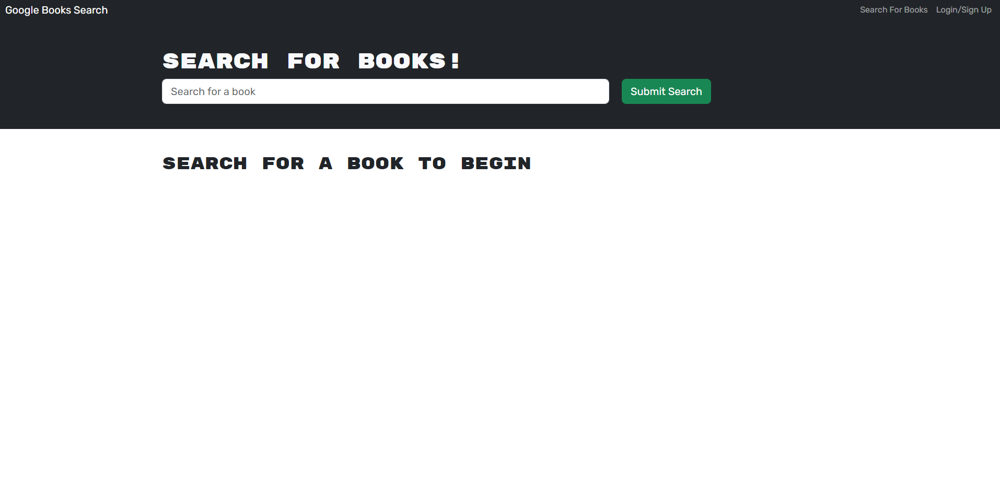

# Book Search Engine Starter Code

## DESCRIPTION

This is a book search engine. I cloned the started code and made modifications to get it into a working state. It allows the user to create an account, sign into an account, search for a book, and delete a book with complete functionality.

## CREDITS

This website was based around starter code and written in part by me, Kyle Oros, with the assistance of a UCI Bootcamp tutor.

## LINKS

https://github.com/kybliss/verbose-carnival

